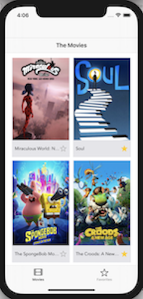
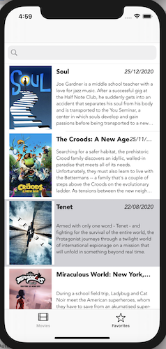
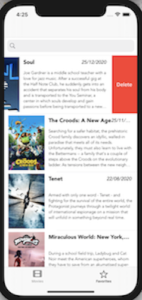
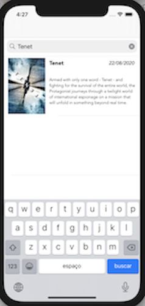
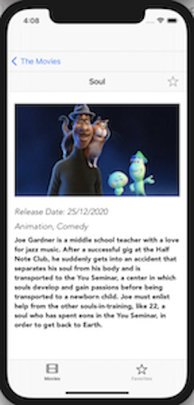

# Projeto para processo seletivo 

###[Victor Vieira Veiga] (https://www.linkedin.com/in/victor-vieira-veiga-96867157)
[GitHub](https://github.com/victorvieiraveiga)
* * *

## Sobre o Projeto

* TELA DE FILMES - Contem a Lista de Filmes carregadas da API, Exibindo Titulo, Poster e estrela de favorito.

      

* TELA DE FAVORITOS -  Esta tela contem lista dos filmes favoritados pelo usuario. Caso esteja vazia exibe uma mensagem para o usuario.
BUSCA: Usuario tamnbem pode realizar buscas de filmes favoritados nessa tela. Caso a busca não retorne resultado uma mensagem é exibida para o usuario.
EXCLUSÃO: Nesta tela tambem é possivel excluir o filme da lista de favoritos, selecionado o filme e arrastando para a esquerda.

    

* TELA DE DETALHES. Nesta tela os detalhes do filme selecionado na pagina principal são visualizados. Contem imagem em maior tamanho, Data de lançamento, Genero e sinopse do filme. Nesta tela é realizada a favoritação do filme clicando na estrela ao lado do titulo. 

  

* * *

## Arquitetura Utilizada

+ ### MVC - Model View Controller

* * *

## LIBS

Utilizei o [Realm](https://realm.io/) para realizar a persistencia dos dados dos filmes favoritados. utilizei essa biblioteca por achar a codificação mais simples e com mais performance que o CoreData. 

* * *

## Execução
* Executar pod install
* Executar prefenciamente no simulador do Iphone 11 ou 12.

* * *

* E-mail: victorvieiraveiga@gmail.com